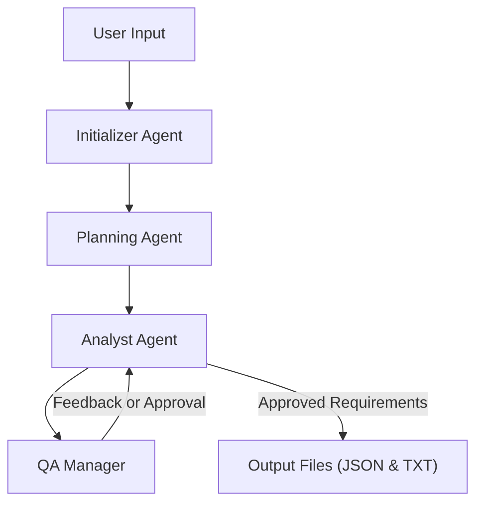
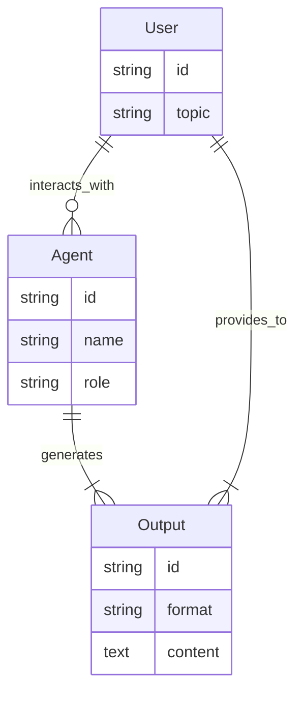

## **AutoRequirementsAgent**

**Description:**

**AutoRequirementsAgent** is a Python-based automation tool designed to streamline the process of generating and refining requirements for any project or topic. Powered by **Open Source LLMs**, it leverages advanced natural language understanding to:

- **Generate a logical plan** tailored to the given topic.
- **Detail requirements** across functional, non-functional, integration, and operational dimensions.
- **Simulate a QA Manager’s review process** for rigorous quality assurance.
- **Output requirements** in JSON and text formats for seamless integration and documentation.

This tool is ideal for developers, project managers, business analysts, and system architects seeking to save time, ensure consistency, and improve the quality of their requirements gathering process.

---

### **Powered By Open Source LLMs**

**AutoRequirementsAgent** utilizes **Llama 3.1 70B**, a state-of-the-art large language model fine-tuned by NVIDIA with **Nemotron**. This ensures:
- High performance in generating structured, domain-specific outputs.
- Open source flexibility for integration and customization.
- Cutting-edge capabilities comparable to proprietary solutions.

By building on open source technology, **AutoRequirementsAgent** combines innovation with accessibility for a wide range of users.

---

### **Key Features**

- **Automated Requirements Generation Workflow:**
  - Creates a step-by-step plan for projects or topics.
  - Outlines actionable and specific requirements.

- **Comprehensive Requirements Detailing:**
  - Breaks down high-level ideas into:
    - **Functional Requirements**
    - **Non-Functional Requirements**
    - **Integration and Operational Requirements**

- **Integrated QA Review Simulation:**
  - Emulates a QA Manager to evaluate completeness, clarity, relevance, and depth.
  - Provides feedback and suggests revisions for higher-quality requirements.

- **Structured Outputs:**
  - Saves results in **JSON** for easy parsing and integration.
  - Provides human-readable text files for sharing and documentation.
  - Saves both the **generated plan** and the **final consolidated report** in JSON and TXT formats for maximum flexibility.

- **Customizable for Specific Domains:**
  - Easily adapt prompts and logic for industry-specific needs, such as healthcare, finance, or IT.

---

### **Installation and Usage**

#### 1. Clone the Repository:

```bash
git clone https://github.com/yourusername/AutoRequirementsAgent.git
```

#### 2. Navigate to the Directory:

```bash
cd AutoRequirementsAgent
```

#### 3. Install Dependencies:

```bash
pip install -r requirements.txt
```

#### 4. Configure the LLM:

- Ensure you have access to the **Llama 3.1 70B** model fine-tuned by NVIDIA with **Nemotron**.
- Update the `gpt5_config` section in the script to match your setup (e.g., base URL, API key, or Docker configuration).

#### 5. Run the Script:

```bash
python autorequirementsagent.py
```

#### 6. Provide Input:

- Enter the **topic** when prompted, such as:
  - "Designing an API security vulnerability scanning service."
  - "Requirements for a cloud-based inventory management system."

---

### **System Design**

#### **High-Level Data Flow Diagram (DFD)**

The following diagram represents the high-level data flow within **AutoRequirementsAgent**:



#### **Entity-Relationship Diagram (ERD)**

The following diagram represents the entities and relationships involved in **AutoRequirementsAgent**:



---

### **Example Use Case**

#### Topic: API Security Vulnerability Scanning Service for a Media Organization

1. **Plan Generation:**
   - The script identifies the objectives, scope, and required components for the service.
2. **Requirements Detailing:**
   - **Functional Requirements:** API discovery, authentication mechanisms, vulnerability scanning.
   - **Non-Functional Requirements:** Scalability, security, compliance with OWASP standards.
   - **Integration Needs:** Reporting findings to an Archer GRC system.
3. **QA Review:**
   - The QA Manager evaluates completeness, clarity, and depth.
   - Feedback or approvals ensure a polished output.
4. **Output Saved:**
   - Results are saved to `generated_plan.json`, `generated_plan.txt`, `consolidated_report.json`, and `consolidated_report.txt`.

---

### **Why Choose AutoRequirementsAgent?**

- **Efficiency:** Reduces the manual effort in requirements gathering and planning.
- **Consistency:** Ensures a structured and standardized output.
- **Quality:** Integrates QA feedback for refined and accurate requirements.
- **Flexibility:** Adapts to diverse topics, industries, and complexities.
- **Seamless Output:** Offers both JSON and text formats for collaboration and integration.
- **Open Source Excellence:** Leverages cutting-edge open source LLM technology for top-tier performance.

---

### **Output Examples**

#### JSON Output:
```json
[
  {
    "STEPID": "1",
    "STEPDETAILS": "Discover all internet-facing APIs of the organization.",
    "OUTPUT": [
      {
        "requirement": "Comprehensive API Discovery",
        "description": "Discover all types of APIs including REST, GraphQL, and SOAP."
      }
    ]
  },
  {
    "STEPID": "2",
    "STEPDETAILS": "Scan APIs for security vulnerabilities.",
    "OUTPUT": [
      {
        "requirement": "Vulnerability Scanning",
        "description": "Perform scans for OWASP API Security Top 10 vulnerabilities."
      }
    ]
  }
]
```

#### Text Output:
```
STEPID: 1
STEPDETAILS: Discover all internet-facing APIs of the organization.

OUTPUT:
- REQUIREMENT: Comprehensive API Discovery
  DESCRIPTION: Discover all types of APIs including REST, GraphQL, and SOAP.

STEPID: 2
STEPDETAILS: Scan APIs for security vulnerabilities.

OUTPUT:
- REQUIREMENT: Vulnerability Scanning
  DESCRIPTION: Perform scans for OWASP API Security Top 10 vulnerabilities.
```

---

### **Contributing**

We welcome contributions! Fork the repository and submit a pull request with enhancements or bug fixes.

---

### **License**

This project is licensed under the Apache License 2.0. See the [LICENSE](LICENSE) file for details.

---

### **Author Information**

- **Author**: Nic Cravino
- **Email**: [spidernic@me.com](mailto:spidernic@me.com)
- **LinkedIn**: [Nic Cravino](https://www.linkedin.com/in/nic-cravino)
- **Date**: November 17, 2024

---

### **Contact**

Have questions or suggestions? Open an issue on the repository or email us at [spidernic@me.com](mailto:spidernic@me.com). 
